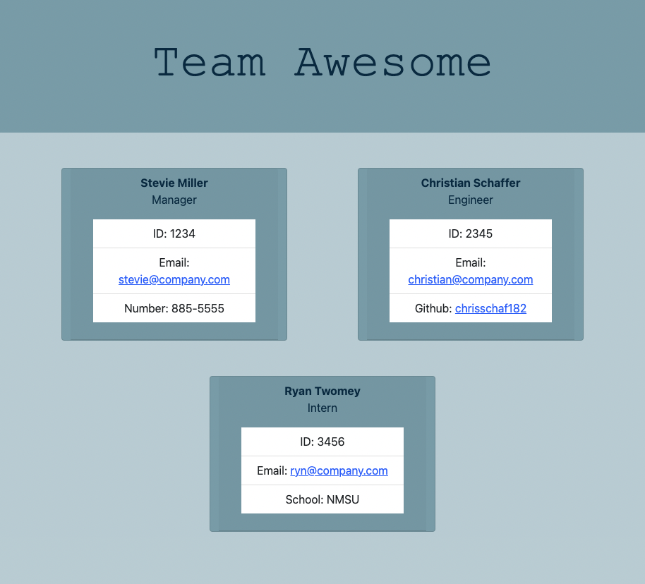

# Team Awesome

## Table of Contents

- [Description](#description)
- [License](#license)
- [Installation](#installation)
- [Usage](#usage)
- [Contributing](#contributing)
- [Tests](#test)
- [Questions](#questions)

## Description

This is an app that generates contact cards for a team of employees based on user input. It uses node.js and jest to run the application and test it's functionality.

## Installation

Clone the repo. Install node.js and jest. Run the application in your code editor's terminal.

## Usage

This app is meant to be used to keep track of employee contact information.

[Click here to view demonstration video](https://drive.google.com/file/d/1kEfrdvSlSwpeIjFeNdUBTe7-607x1ssY/view)

## License

This project uses MIT
[Click here to view license](https://opensource.org/licenses/MIT)

## Contributing

Clone the repo.

## Tests

Jest

## Questions

- Author: Stevie Miller
- GitHub: [StevieMiller](https://github.com/StevieMiller)
- Email: stephanie.miller@carlsbadschools.net
